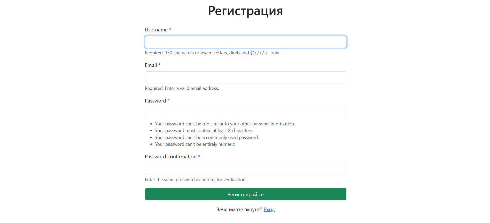
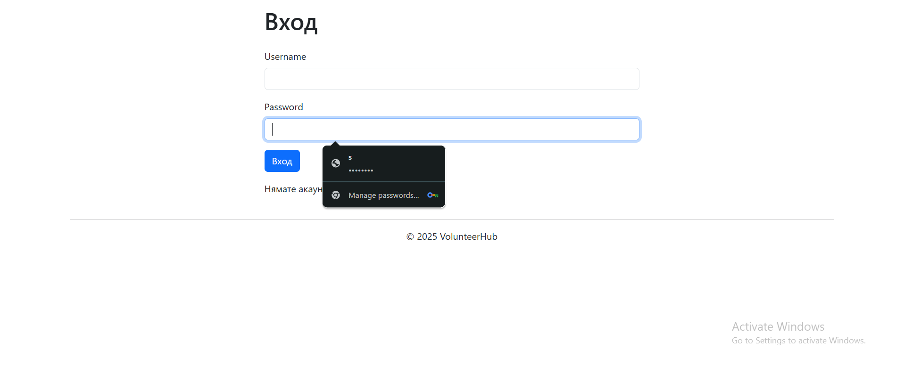
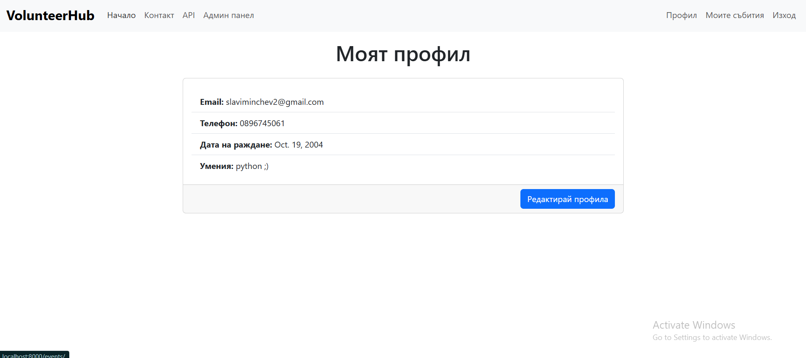
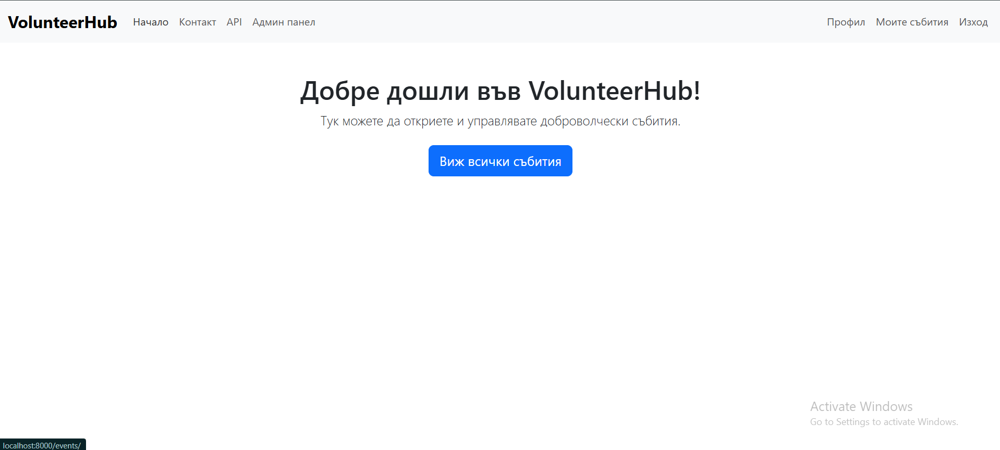
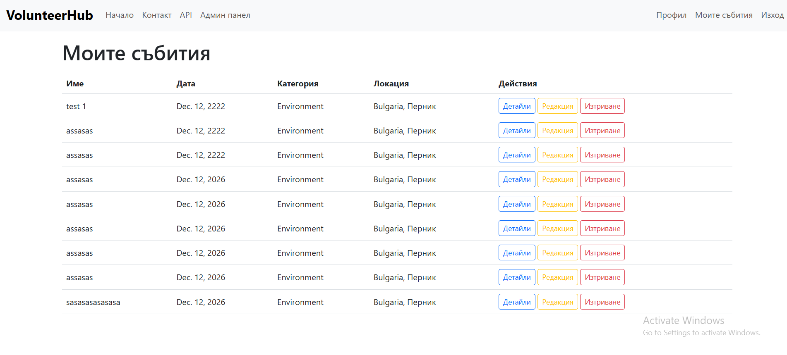
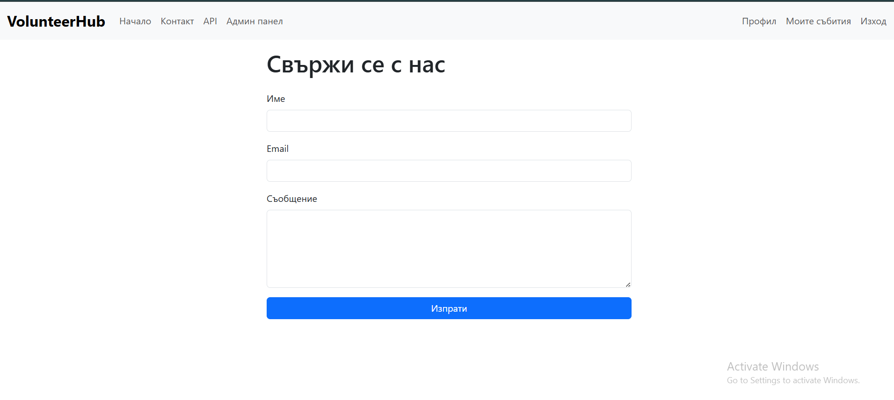
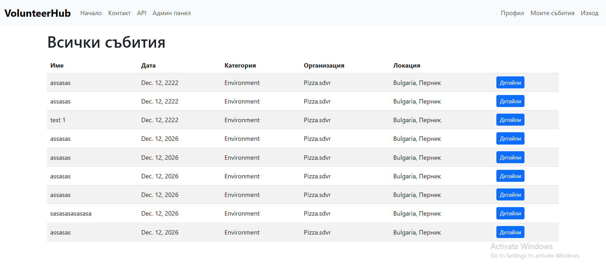
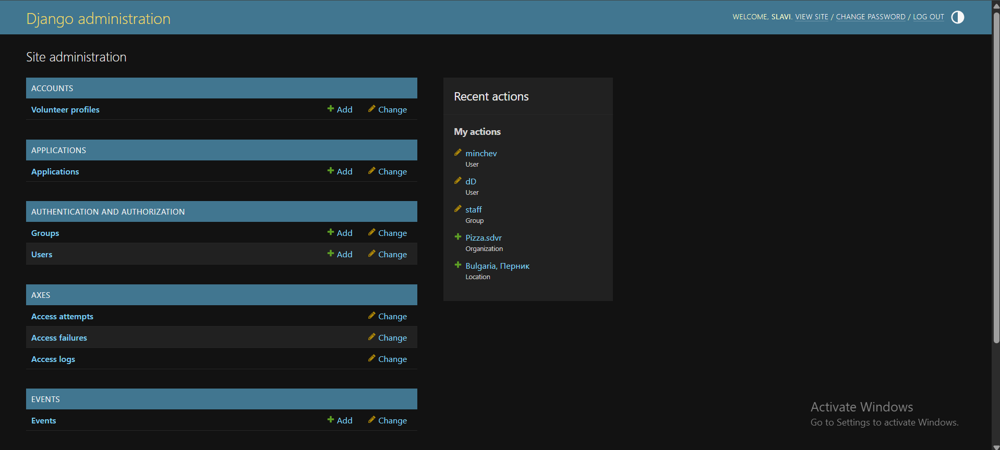
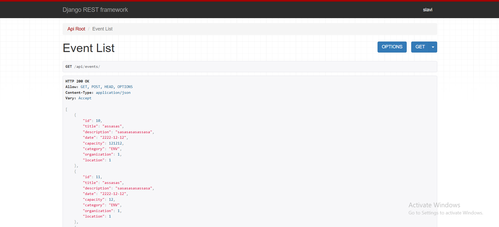

# VolunteerHub

VolunteerHub е уеб приложение за управление на доброволчески инициативи и събития. Проектът е разработен с Django, Bootstrap и PostgreSQL. Подходящ е за НПО-та, училища и университети, които искат лесно да организират доброволци, събития и кандидатури.

---

## Функционалности

- 🔑 Регистрация и вход за потребители (доброволци и организации)
- 📅 Създаване, редакция и изтриване на събития
- 📝 Кандидатстване за участие в събития
- 🏢 Управление на организации и локации
- 📄 Административен панел с custom функционалности
- 📱 Responsive дизайн (Bootstrap)
- ✅ Валидация на форми и custom error handling
- 🔒 Сигурност: защита на данни, CSRF, rate limiting
- 🧪 Покритие с unit тестове
- 🌐 REST API (базов)
- ⚡ Middleware за логване на грешки и custom 404/500 страници

---

## 📸 Демонстрация на VolunteerHub

### 1. Регистрация на нов потребител

> Потребителят въвежда своите данни, за да си направи нов профил.

---

### 2. Вход в профила

> Влизане с потребителско име и парола.

---

### 3. Начална страница след вход

> Посреща те "Добре дошли във VolunteerHub!" и може да разгледаш всички събития.

---

### 4. Моят профил

> Виждаш имейл, телефон, дата на раждане и умения.

---

### 5. Моите събития

> Таблица с всички събития, които си създал – можеш да ги редактираш, триеш или разглеждаш детайли.

---

### 6. Всички събития

> Пълен списък на всички доброволчески събития във платформата.

---

### 7. Свържи се с нас

> Форма за контакт с екипа на сайта.

---

### 8. Django Admin панел

> Пълен административен контрол върху всички модели и данни.

---

### 9. REST API събития

> Преглед и работа с API-то за събития през Django REST Framework.

---

## ⚠️ Важно: Папка `media/` и профилна снимка по подразбиране

- **Папката `media/` НЕ се съдържа в репото, защото обикновено съдържа лични качени файлове и е добавена в `.gitignore`.**
- За да работят профилните снимки, трябва ръчно да създадеш следната структура в корена на проекта:

media/
profile_images/
default.png


- В папката `profile_images/` сложете снимка по подразбиране с име **`default.png`**
- 
- **Примерно изображение за default профилна снимка:**  


- Качените от потребители снимки ще се съхраняват в тази папка автоматично при използване на сайта.

> **Ако папката `media/` липсва или няма default.png, профилните снимки няма да се зареждат!**

---

## Инсталация

```bash
git clone https://github.com/Yoan-Stanislav/VolunteerHub.git
cd VolunteerHub
python -m venv .venv
source .venv/bin/activate  # Windows: .venv\Scripts\activate
pip install -r requirements.txt
cp .env.example .env       # Попълни променливите!
python manage.py migrate
python manage.py createsuperuser
# 🔽 Тук създай папката media, ако искаш профилни снимки!
python manage.py runserver
Какво е това?
Уеб приложение за доброволчески инициативи.

Как се стартира?
Клонирай репото.

pip install -r VolunteerHub/requirements.txt

python manage.py migrate

python manage.py runserver

Достъп през localhost:8000


