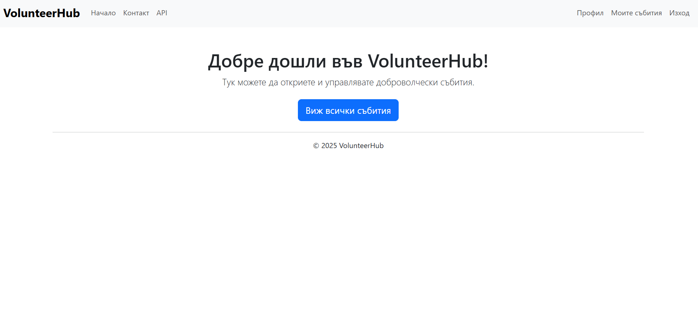

# VolunteerHub

## Какво е това?
Уеб приложение за доброволчески инициативи.

## Как се стартира?
1. Клонирай репото.
2. `pip install -r VolunteerHub/requirements.txt`
3. `python manage.py migrate`
4. `python manage.py runserver`
5. Достъп през [localhost:8000](http://localhost:8000)

